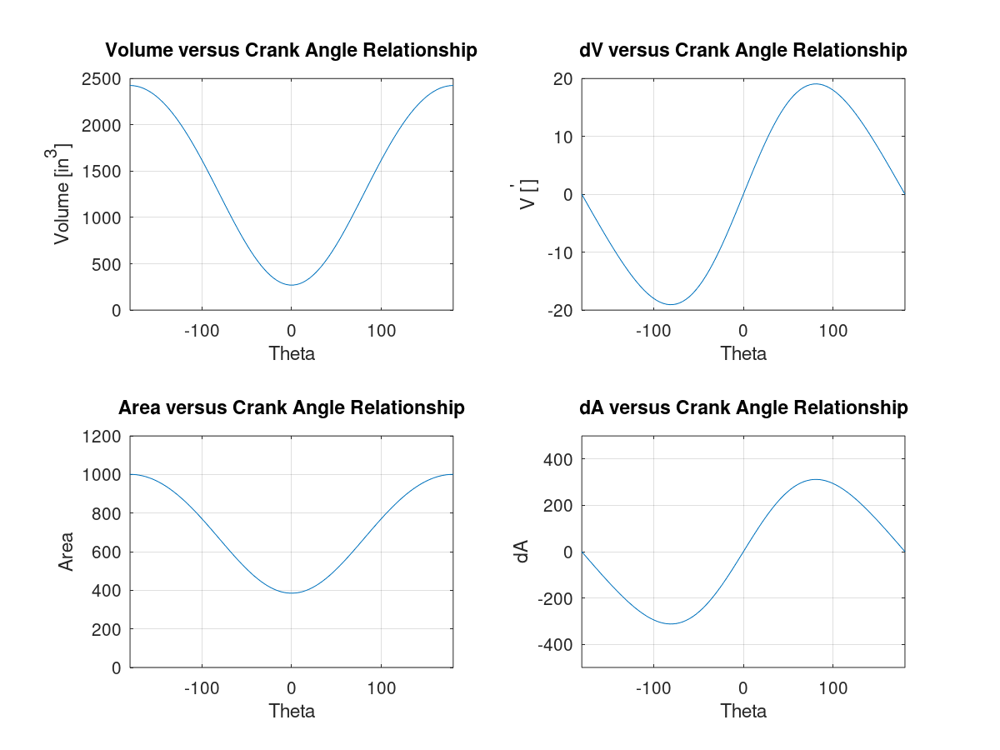

# Overview #

These are examples for the Octave demo and tutorial for FLUX, my local Linux LUG.

# Examples #

## Basic ##

## Finance ##

## Physics ##

### Internal Combustion Engine ###
 
From : https://octave.1599824.n4.nabble.com/Code-Problem-td4695793.html#a4695797

From a post on the Gnu Octave help forum, this program calculates and graphs
functions related to internal combustion engines. (In progress. Testing needed.)

Format: 
